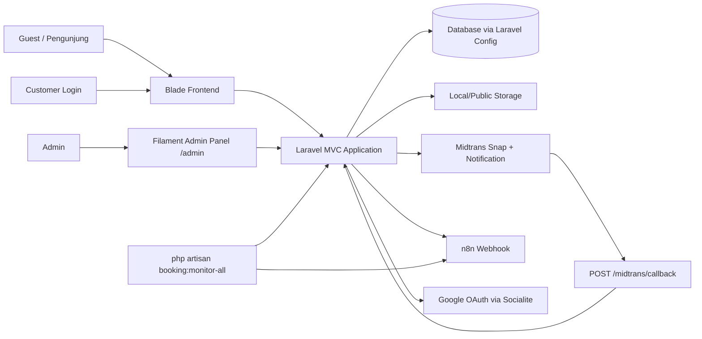
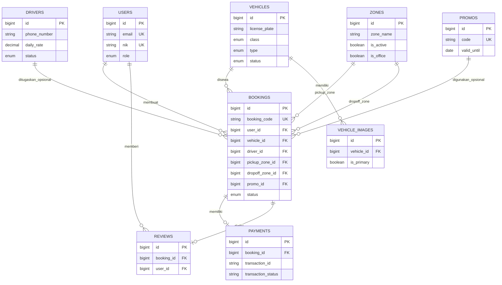
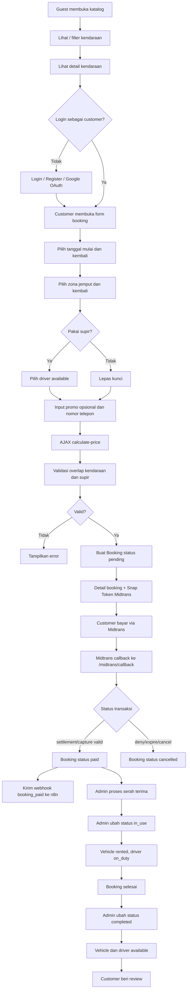
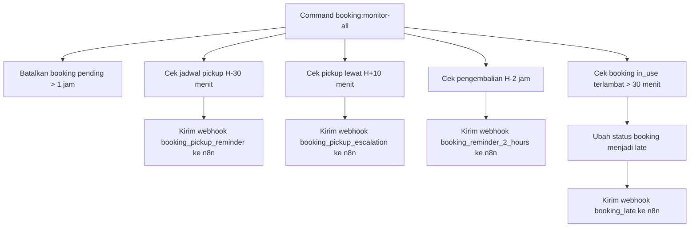

# LAPORAN ARSITEKTUR SISTEM DAN PERANCANGAN DATABASE

## Project: KlikRental

Dokumen ini disusun berdasarkan audit implementasi aktual source code Laravel, bukan berdasarkan README sebagai sumber utama. README hanya digunakan sebagai pembanding historis.

Sumber utama audit:

- `routes/web.php`
- `routes/auth.php`
- `app/Models/*`
- `app/Http/Controllers/*`
- `app/Filament/Admin/*`
- `app/Console/Commands/BookingMonitor.php`
- `database/migrations/*`
- `config/*`
- `resources/views/*`
- `composer.json`
- `package.json`

---

# 1. DESKRIPSI SISTEM

## 1.1 Nama Sistem

Nama sistem adalah **KlikRental**.

Bukti:

- `app/Providers/Filament/AdminPanelProvider.php`: brand panel admin adalah `KlikRental Admin`.
- README historis juga menggunakan nama `KlikRental`, tetapi deskripsi laporan ini tetap mengacu pada implementasi aktual.

## 1.2 Tujuan Sistem

KlikRental adalah aplikasi web untuk layanan penyewaan kendaraan. Implementasi aktual menunjukkan sistem digunakan untuk:

- menampilkan katalog kendaraan;
- memfilter kendaraan berdasarkan tipe, kelas, dan tanggal sewa;
- menampilkan detail kendaraan dan galeri gambar;
- menampilkan daftar supir;
- membuat booking rental kendaraan;
- memilih lokasi jemput dan lokasi kembali;
- memilih supir opsional;
- menghitung harga sewa berdasarkan durasi, kendaraan, supir, zona, promo, dan pajak;
- melakukan pembayaran melalui Midtrans Snap;
- menerima webhook pembayaran Midtrans;
- mengirim webhook otomatis ke n8n;
- memantau booking melalui command scheduler;
- mengelola data operasional melalui Filament Admin.

Bukti:

- `routes/web.php`: route katalog, booking, driver, Midtrans, Google OAuth, profile.
- `app/Http/Controllers/HomeController.php`: katalog, filter kendaraan, statistik, review.
- `app/Http/Controllers/BookingController.php`: create, store, calculatePrice, show, cancel, storeReview.
- `app/Http/Controllers/MidtransController.php`: webhook pembayaran dan webhook n8n.
- `app/Console/Commands/BookingMonitor.php`: monitoring booking, reminder, late detection.

## 1.3 Jenis Aplikasi

Jenis aplikasi adalah **aplikasi web rental kendaraan berbasis Laravel** dengan:

- frontend server-rendered menggunakan Blade;
- backend Laravel MVC;
- panel admin menggunakan Filament;
- autentikasi Laravel Breeze;
- integrasi Google OAuth;
- integrasi Midtrans;
- integrasi webhook n8n;
- command scheduler untuk monitoring booking.

## 1.4 Aktor Sistem

Aktor yang benar-benar ditemukan pada source code:

| Aktor | Bukti Implementasi | Peran Aktual |
|---|---|---|
| Guest / Pengunjung | `routes/web.php` route publik `/`, `/dashboard`, `/vehicles`, `/kendaraan/{id}`, `/driver-kami`, `/cs`, `/about` | Melihat katalog kendaraan, detail kendaraan, daftar supir, halaman CS, about, privacy, terms |
| Customer | `routes/web.php` middleware `auth`, `role:customer`; `users.role` default `customer`; `GoogleController` membuat user role `customer` | Membuat booking, melihat booking pribadi, membatalkan booking pending, memberi review setelah completed |
| Admin | `User::canAccessPanel()` mengizinkan panel jika `role === 'admin'`; `AdminPanelProvider` path `/admin` | Mengakses Filament Admin untuk mengelola kendaraan, booking, supir, zona, promo, tim, dashboard statistik |
| Staff | enum `users.role` berisi `staff` | Ada di database, tetapi tidak ditemukan logika akses khusus staff |
| Driver / Supir | tabel dan model `drivers`, route publik `/driver-kami`, relasi booking opsional | Entitas operasional, bukan user login. Driver dipilih dalam booking dan menerima data pada payload n8n jika ada |

Aktor yang tidak ditemukan sebagai role login aktual:

- Owner: tidak ditemukan role atau middleware khusus.
- Mitra: tidak ditemukan role atau middleware khusus.

---

# 2. ARSITEKTUR SISTEM

## 2.1 Frontend

| Komponen | Status | Bukti |
|---|---:|---|
| Blade | Ada | `resources/views/*.blade.php` |
| Tailwind CSS | Ada | `package.json` berisi `tailwindcss`, `@tailwindcss/forms`; `resources/css/app.css` |
| Alpine.js | Ada | `package.json` berisi `alpinejs`; beberapa view memakai `x-data` |
| Vite | Ada | `vite.config.js`, `package.json` script `dev` dan `build` |
| Filament UI | Ada untuk admin | `app/Providers/Filament/AdminPanelProvider.php`, `app/Filament/Admin/*` |
| React | Tidak ditemukan | Tidak ada dependency React di `package.json` |
| Vue | Tidak ditemukan | Tidak ada dependency Vue di `package.json` |
| Livewire | Tidak eksplisit ditemukan sebagai app code | Filament menggunakan stack internalnya, tetapi tidak ada komponen Livewire custom di `app/Livewire` |
| Bootstrap | Tidak ditemukan | Tidak ada dependency Bootstrap di `package.json` |

## 2.2 Backend

| Komponen | Status | Bukti |
|---|---:|---|
| Laravel | Ada | `composer.json` require `laravel/framework` `^13.0` |
| PHP | Ada | `composer.json` require `php` `^8.3` |
| MVC | Ada | `app/Models`, `app/Http/Controllers`, `resources/views` |
| Laravel Breeze | Ada | `composer.json` require-dev `laravel/breeze`; route auth di `routes/auth.php` |
| Filament | Ada | `composer.json` require `filament/filament` `^5.6`; `app/Filament/Admin/*` |
| REST API | Tidak ada API route terpisah | Tidak ditemukan `routes/api.php`; hanya JSON endpoint internal `booking.calculatePrice` |
| Service Layer | Tidak ditemukan folder `app/Services` | Logic utama berada di Controller, Model, Command |
| Repository Pattern | Tidak ditemukan | Tidak ada folder repository atau interface repository |
| Queue table | Ada | migration `0001_01_01_000002_create_jobs_table.php` |
| Job class custom | Tidak ditemukan | Tidak ada file di `app/Jobs` |
| Console Command | Ada | `app/Console/Commands/BookingMonitor.php` |

## 2.3 Database

Konfigurasi default database di `config/database.php` adalah:

```php
'default' => env('DB_CONNECTION', 'sqlite')
```

Artinya implementasi aktual default menggunakan **SQLite** jika `DB_CONNECTION` tidak diatur di `.env`. File konfigurasi juga mendefinisikan koneksi MySQL, MariaDB, PostgreSQL, SQL Server, dan Redis sebagai opsi Laravel standar.

Catatan mismatch README:

- README menulis database MySQL 8.0.
- Source code aktual default config adalah SQLite.
- Database runtime sebenarnya tetap bergantung pada `.env`, tetapi `.env` tidak dijadikan sumber audit karena tidak termasuk source code umum.

## 2.4 Layanan Eksternal

| Layanan | Status | Bukti Aktual |
|---|---:|---|
| Midtrans | Ada | `composer.json` require `midtrans/midtrans-php`; `config/midtrans.php`; `BookingController` menggunakan `Midtrans\Snap`; `MidtransController` menggunakan `Midtrans\Notification` |
| n8n | Ada | `MidtransController` dan `BookingMonitor` memakai `env('N8N_WEBHOOK_URL')` dan HTTP POST |
| WhatsApp Gateway | Tidak langsung ditemukan sebagai package/API WA | Payload n8n berisi nomor customer/admin/driver dan komentar menyebut WA, tetapi source Laravel hanya mengirim ke n8n |
| Google OAuth | Ada | `laravel/socialite`; `config/services.php` key `google`; `GoogleController` |
| Email | Ada sebagai konfigurasi Laravel/Breeze | `config/mail.php`, auth email verification/password reset |
| Firebase | Tidak ditemukan | Tidak ada dependency/config Firebase |
| Telegram | Tidak ditemukan di source aktual | Hanya ada di README historis |
| Cloud Storage S3 | Opsi config standar ada | `config/filesystems.php` mendefinisikan disk `s3`, tetapi tidak ditemukan integrasi bisnis khusus |

## 2.5 Diagram Arsitektur Sistem



---

# 3. PENERAPAN MVC

## 3.1 Model

| Model | Fungsi |
|---|---|
| `User` | Identitas pengguna, role `admin/customer/staff`, akses Filament admin, avatar Google/storage/UI avatars |
| `Vehicle` | Data kendaraan, status ketersediaan, gambar utama, galeri gambar, review melalui booking |
| `VehicleImage` | Galeri gambar kendaraan, termasuk tanda gambar utama |
| `Driver` | Data supir, tarif harian, status, histori booking, rating melalui review |
| `Zone` | Zona jemput/kembali, biaya tambahan, status aktif, kantor cabang, alamat, koordinat |
| `Promo` | Kode promo, persentase diskon, batas maksimal diskon, masa berlaku |
| `Booking` | Transaksi rental utama, pricing, status lifecycle, relasi ke user/kendaraan/supir/zona/promo/payment/review |
| `Payment` | Catatan pembayaran per booking |
| `Review` | Ulasan booking oleh user untuk kendaraan, perusahaan, dan supir |
| `TeamMember` | Data tim untuk halaman about |

## 3.2 Controller

| Controller | Fungsi |
|---|---|
| `HomeController` | Katalog kendaraan, filter kendaraan, halaman dashboard/welcome, detail kendaraan, statistik dan review |
| `BookingController` | Form booking, validasi booking, cek overlap, kalkulasi harga, Midtrans Snap token, daftar booking customer, cancel, review |
| `MidtransController` | Webhook callback Midtrans, update status booking, trigger webhook n8n |
| `DriverController` | Daftar supir dan detail supir beserta rating/review |
| `ProfileController` | Edit/update/delete profil pengguna |
| `HealthCheckController` | Health check |
| `Auth/*Controller` | Login, register, password reset, email verification, Google OAuth |

## 3.3 View

| View | Fungsi |
|---|---|
| `dashboard.blade.php` | Dashboard/katalog utama kendaraan |
| `vehicle/index.blade.php` | List kendaraan |
| `vehicle/show.blade.php` | Detail kendaraan |
| `booking/create.blade.php` | Form pembuatan booking |
| `booking/show.blade.php` | Detail booking, invoice, tombol bayar Midtrans |
| `booking/index.blade.php` | Daftar booking milik customer dan review modal |
| `driver/index.blade.php` | Daftar supir |
| `driver/show.blade.php` | Detail supir dan ulasan |
| `auth/*.blade.php` | Login, register, forgot/reset password, verify email |
| `profile/edit.blade.php` | Edit profil |
| `cs.blade.php` | Halaman CS/kantor cabang aktif |
| `about.blade.php` | Halaman about/team members |
| `privacy.blade.php`, `terms.blade.php` | Informasi kebijakan dan syarat |
| `errors/*.blade.php` | Halaman error |

## 3.4 Contoh Alur MVC Aktual

### Alur katalog kendaraan

```text
User membuka /dashboard atau /
-> routes/web.php memanggil HomeController@index atau welcome
-> HomeController mengambil Zone, Vehicle, Booking, Review
-> data dikirim ke resources/views/dashboard.blade.php
```

### Alur detail kendaraan

```text
User membuka /kendaraan/{id}
-> HomeController@show
-> Vehicle::with(['images', 'primaryImage', 'reviews.user'])
-> resources/views/vehicle/show.blade.php
```

### Alur booking customer

```text
Customer membuka /booking/{vehicle}/create
-> BookingController@create
-> mengambil Vehicle, Zone, Driver, Booking, Promo
-> resources/views/booking/create.blade.php
-> submit POST /booking
-> BookingController@store
-> validasi, cek overlap, hitung harga, Booking::create()
-> redirect ke booking.show
```

### Alur pembayaran

```text
Customer membuka detail booking pending
-> BookingController@show
-> Midtrans Snap::getSnapToken()
-> resources/views/booking/show.blade.php
-> Midtrans callback POST /midtrans/callback
-> MidtransController@handleNotification
-> update Booking status paid/cancelled/pending
-> jika paid, kirim webhook ke n8n
```

---

# 4. ENTITY RELATIONSHIP DIAGRAM



---

# 5. STRUKTUR TABEL

## 5.1 `users`

Fungsi: menyimpan akun pengguna, data identitas, role, dan informasi login Google.

| Kolom | Tipe | Key | Keterangan |
|---|---|---|---|
| id | bigint | PK | Primary key |
| name | string |  | Nama pengguna |
| email | string | Unique | Email login |
| email_verified_at | timestamp nullable |  | Verifikasi email |
| password | string |  | Password hash |
| phone_number | string nullable |  | Nomor telepon/WA |
| nik | string(16) nullable | Unique | Nomor identitas |
| address | text nullable |  | Alamat |
| ktp_image_url | string nullable |  | File/URL KTP |
| sim_image_url | string nullable |  | File/URL SIM |
| role | enum admin/customer/staff |  | Role user, default customer |
| google_id | string nullable | Unique pada migration tambahan, tetapi sudah ada sebelumnya tanpa unique | ID Google OAuth |
| avatar | string nullable |  | Avatar Google/storage |
| remember_token | string nullable |  | Token remember me |
| created_at | timestamp |  | Waktu dibuat |
| updated_at | timestamp |  | Waktu diubah |

Catatan teknis: `google_id` dibuat pada migration awal, lalu ditambahkan lagi pada migration `add_google_id_to_users_table`. Ini berpotensi gagal saat fresh migration.

## 5.2 `vehicles`

Fungsi: menyimpan data armada kendaraan.

| Kolom | Tipe | Key | Keterangan |
|---|---|---|---|
| id | bigint | PK | Primary key |
| name | string |  | Nama kendaraan |
| license_plate | string nullable |  | Plat nomor |
| type | enum SUV/MPV/Sedan/Hatchback/Minibus |  | Jenis kendaraan |
| class | enum Standard/Premium/VIP |  | Kelas kendaraan |
| transmission | enum Manual/Automatic |  | Transmisi |
| fuel_type | string |  | Bahan bakar |
| seats | integer |  | Jumlah kursi |
| luggage_capacity | integer |  | Kapasitas bagasi |
| price_per_day | decimal(12,2) |  | Harga per hari |
| status | enum available/rented/maintenance |  | Status armada |
| image_url | string nullable |  | Kolom gambar lama/utama |
| created_at | timestamp |  | Waktu dibuat |
| updated_at | timestamp |  | Waktu diubah |

## 5.3 `vehicle_images`

Fungsi: menyimpan banyak gambar untuk satu kendaraan.

| Kolom | Tipe | Key | Keterangan |
|---|---|---|---|
| id | bigint | PK | Primary key |
| vehicle_id | foreignId | FK vehicles.id | Kendaraan |
| image_url | string |  | Path/URL gambar |
| is_primary | boolean |  | Penanda gambar utama |
| created_at | timestamp |  | Waktu dibuat |
| updated_at | timestamp |  | Waktu diubah |

## 5.4 `drivers`

Fungsi: menyimpan data supir yang dapat dipilih secara opsional dalam booking.

| Kolom | Tipe | Key | Keterangan |
|---|---|---|---|
| id | bigint | PK | Primary key |
| name | string |  | Nama supir |
| phone_number | string |  | Nomor telepon/WA supir |
| daily_rate | decimal(12,2) |  | Tarif per hari |
| image_url | string nullable |  | Foto supir |
| status | enum available/on_duty/inactive |  | Status supir |
| created_at | timestamp |  | Waktu dibuat |
| updated_at | timestamp |  | Waktu diubah |

## 5.5 `zones`

Fungsi: menyimpan zona/lokasi jemput dan kembali serta kantor cabang.

| Kolom | Tipe | Key | Keterangan |
|---|---|---|---|
| id | bigint | PK | Primary key |
| zone_name | string |  | Nama zona |
| additional_cost | decimal(12,2) |  | Biaya tambahan |
| is_active | boolean |  | Status zona aktif/tidak |
| is_office | boolean |  | Penanda kantor cabang |
| address | text nullable |  | Alamat kantor/zona |
| maps_link | text nullable |  | Link Google Maps |
| latitude | decimal(10,8) nullable |  | Koordinat latitude |
| longitude | decimal(11,8) nullable |  | Koordinat longitude |
| created_at | timestamp |  | Waktu dibuat |
| updated_at | timestamp |  | Waktu diubah |

## 5.6 `promos`

Fungsi: menyimpan kupon promo yang dapat digunakan saat booking.

| Kolom | Tipe | Key | Keterangan |
|---|---|---|---|
| id | bigint | PK | Primary key |
| code | string | Unique | Kode promo |
| discount_percentage | integer |  | Persentase diskon |
| max_discount | decimal(12,2) |  | Batas maksimal diskon |
| valid_until | date |  | Tanggal berlaku sampai |
| created_at | timestamp |  | Waktu dibuat |
| updated_at | timestamp |  | Waktu diubah |

## 5.7 `bookings`

Fungsi: tabel transaksi utama rental kendaraan.

| Kolom | Tipe | Key | Keterangan |
|---|---|---|---|
| id | bigint | PK | Primary key |
| booking_code | string | Unique | Kode booking |
| user_id | foreignId | FK users.id | Customer |
| vehicle_id | foreignId | FK vehicles.id | Kendaraan |
| driver_id | foreignId nullable | FK drivers.id | Supir opsional |
| pickup_zone_id | foreignId | FK zones.id | Zona jemput |
| dropoff_zone_id | foreignId | FK zones.id | Zona kembali |
| promo_id | foreignId nullable | FK promos.id | Promo opsional |
| start_date | dateTime |  | Mulai rental |
| end_date | dateTime |  | Selesai rental |
| subtotal | decimal(12,2) |  | Total sebelum pajak setelah komponen biaya |
| tax_rate | integer |  | Pajak, default 11 |
| tax_amount | decimal(12,2) |  | Nilai pajak |
| total_price | decimal(12,2) |  | Total akhir |
| status | enum pending/paid/in_use/late/completed/cancelled |  | Status booking |
| late_fee | decimal(12,2) |  | Denda keterlambatan |
| created_at | timestamp |  | Waktu dibuat |
| updated_at | timestamp |  | Waktu diubah |

## 5.8 `payments`

Fungsi: menyimpan catatan pembayaran yang berelasi ke booking.

| Kolom | Tipe | Key | Keterangan |
|---|---|---|---|
| id | bigint | PK | Primary key |
| booking_id | foreignId | FK bookings.id | Booking |
| transaction_id | string nullable |  | ID transaksi Midtrans |
| payment_type | string nullable |  | Jenis pembayaran |
| gross_amount | decimal(12,2) |  | Nominal kotor |
| transaction_status | string |  | Status transaksi, default pending |
| settlement_time | dateTime nullable |  | Waktu settlement |
| created_at | timestamp |  | Waktu dibuat |
| updated_at | timestamp |  | Waktu diubah |

Catatan teknis: model `Payment` tersedia dan memiliki relasi `belongsTo(Booking)`, tetapi `MidtransController` saat ini hanya mengubah status `Booking`; belum ditemukan penyimpanan data callback ke tabel `payments`.

## 5.9 `reviews`

Fungsi: menyimpan ulasan customer setelah booking selesai.

| Kolom | Tipe | Key | Keterangan |
|---|---|---|---|
| id | bigint | PK | Primary key |
| booking_id | foreignId | FK bookings.id | Booking yang direview |
| user_id | foreignId | FK users.id | User pemberi review |
| vehicle_rating | integer |  | Rating kendaraan 1-5 |
| company_rating | integer |  | Rating perusahaan 1-5 |
| driver_rating | integer nullable |  | Rating supir, opsional |
| comment | text nullable |  | Komentar |
| created_at | timestamp |  | Waktu dibuat |
| updated_at | timestamp |  | Waktu diubah |

## 5.10 `team_members`

Fungsi: data anggota tim untuk halaman about.

| Kolom | Tipe | Key | Keterangan |
|---|---|---|---|
| id | bigint | PK | Primary key |
| name | string |  | Nama anggota |
| role | string |  | Jobdesk/peran |
| photo | string nullable |  | Foto |
| created_at | timestamp |  | Waktu dibuat |
| updated_at | timestamp |  | Waktu diubah |

## 5.11 Tabel Framework Laravel

| Tabel | Fungsi |
|---|---|
| `cache` | Penyimpanan cache database |
| `cache_locks` | Lock cache |
| `jobs` | Queue jobs database |
| `job_batches` | Batch queue |
| `failed_jobs` | Catatan job gagal |

Catatan: `sessions` dan `password_reset_tokens` di-drop pada `down()` migration users, tetapi tidak ditemukan pembuatan tabel tersebut pada migration yang ada.

---

# 6. RELASI ANTAR TABEL

## 6.1 One to One / One to Zero-One

| Relasi | Bukti |
|---|---|
| `bookings (1) -- (0/1) payments` | `Booking::payment()` memakai `hasOne(Payment::class)`; `payments.booking_id` FK |
| `bookings (1) -- (0/1) reviews` | `Booking::review()` memakai `hasOne(Review::class)`; `reviews.booking_id` FK |
| `vehicles (1) -- (0/1) primaryImage` | `Vehicle::primaryImage()` memakai `hasOne(VehicleImage::class)->where('is_primary', true)` |

## 6.2 One to Many

| Relasi | Bukti |
|---|---|
| `users (1) -- (N) bookings` | `bookings.user_id` FK; `Booking::user()` belongsTo |
| `users (1) -- (N) reviews` | `reviews.user_id` FK; `Review::user()` belongsTo |
| `vehicles (1) -- (N) bookings` | `bookings.vehicle_id` FK; `Booking::vehicle()` belongsTo |
| `vehicles (1) -- (N) vehicle_images` | `Vehicle::images()` hasMany; `vehicle_images.vehicle_id` FK |
| `drivers (1) -- (N) bookings` | `Driver::bookings()` hasMany; `bookings.driver_id` FK nullable |
| `zones (1) -- (N) bookings sebagai pickup_zone` | `bookings.pickup_zone_id` FK ke `zones`; `Booking::pickupZone()` |
| `zones (1) -- (N) bookings sebagai dropoff_zone` | `bookings.dropoff_zone_id` FK ke `zones`; `Booking::dropoffZone()` |
| `promos (1) -- (N) bookings` | `bookings.promo_id` FK nullable; `Booking::promo()` |

## 6.3 Many to Many

Tidak ditemukan tabel pivot many-to-many eksplisit pada implementasi aktual. Relasi kendaraan ke review dan driver ke review menggunakan `hasManyThrough` melalui `bookings`, bukan many-to-many pivot.

---

# 7. FLOWCHART PROSES BISNIS

## 7.1 Flow Booking dan Pembayaran



## 7.2 Flow Monitoring Otomatis



---

# 8. FITUR SISTEM

## 8.1 Fitur Sudah Terimplementasi

| Fitur | Bukti |
|---|---|
| Katalog kendaraan | `HomeController@index`, `dashboard.blade.php`, `vehicle/index.blade.php` |
| Filter kendaraan berdasarkan type/class/tanggal | `HomeController@index` |
| Detail kendaraan dan galeri | `HomeController@show`, model `VehicleImage` |
| Daftar dan detail supir | `DriverController`, views `driver/index`, `driver/show` |
| Booking customer | `BookingController@create`, `store`, `routes/web.php` |
| Cek double booking kendaraan | `BookingController@store`, `calculateBookingPricing` |
| Cek overlap supir | `BookingController@store` |
| Dynamic pricing | `BookingController@calculatePrice`, `calculateBookingPricing`, `Booking::calculatePricing` |
| Promo | migration/model `Promo`, query promo aktif di controller |
| Pajak 11% | `bookings.tax_rate`, controller/model pricing |
| Midtrans Snap | `BookingController@show` |
| Midtrans callback | `MidtransController@handleNotification` |
| n8n webhook | `MidtransController::sendWebhookToN8n`, `BookingMonitor::buildAndSendWebhook` |
| Google OAuth | `GoogleController`, `config/services.php`, `laravel/socialite` |
| Review setelah completed | `BookingController@storeReview` |
| Admin panel Filament | `AdminPanelProvider`, resources `Bookings`, `Vehicles`, `Drivers`, `Zones`, `Promos`, `TeamMembers` |
| Dashboard admin widgets | `BookingStatsOverview`, `RevenueChart`, `LatestBookings`, `VehicleStatusChart` |
| Monitoring booking via command | `BookingMonitor` |
| Halaman CS kantor cabang | route `/cs`, tabel `zones` dengan `is_office` |
| Halaman about/team | route `/about`, tabel `team_members` |
| Profile user | `ProfileController`, views profile |
| Auth Breeze | `routes/auth.php`, auth controllers/views |

## 8.2 Fitur Masih Rencana / Belum Terbukti Lengkap

| Fitur | Status Audit |
|---|---|
| Role `staff` | Ada di enum database, tetapi tidak ditemukan akses/middleware khusus |
| Middleware role customer | Route memakai `role:customer`, tetapi `RoleManager` hanya `return $next($request)` sehingga tidak memvalidasi role |
| Penyimpanan payment detail ke tabel `payments` | Tabel dan model ada, tetapi callback Midtrans tidak membuat/update record `payments` |
| WhatsApp Gateway langsung | Tidak ditemukan integrasi WAHA/API WhatsApp langsung di Laravel; Laravel hanya POST ke n8n |
| Telegram | Tidak ditemukan di source aktual |
| Firebase | Tidak ditemukan |
| Repository pattern / Service layer | Tidak ditemukan |
| Job class custom | Tabel jobs ada, tetapi tidak ada `app/Jobs` custom |
| REST API publik | Tidak ditemukan `routes/api.php` |

---

# 9. TEMUAN TEKNIS

## 9.1 Temuan Positif

1. Arsitektur MVC sudah jelas: Model, Controller, View, migration, dan Filament resource dipisahkan.
2. Booking memiliki validasi overlap kendaraan dan supir di backend.
3. Pricing memperhitungkan durasi, kendaraan, supir, zona jemput, zona kembali, promo, dan pajak.
4. Integrasi Midtrans sudah ada untuk Snap Token dan callback.
5. Integrasi n8n sudah ada melalui HTTP POST dengan payload bisnis.
6. Model `Booking` memiliki event `booted()` untuk sinkronisasi status kendaraan dan supir.
7. Filament admin panel menyediakan resource operasional utama dan dashboard widget.
8. Google OAuth sudah diimplementasikan melalui Socialite.

## 9.2 Temuan Risiko / Ketidaksesuaian

| Temuan | Dampak | Bukti |
|---|---|---|
| `RoleManager` tidak mengecek role | Route `role:customer` tidak benar-benar membatasi customer jika middleware ini yang aktif | `app/Http/Middleware/RoleManager.php` hanya memanggil `$next($request)` |
| `google_id` dibuat dua kali | Fresh migration dapat gagal karena kolom sudah ada lalu ditambahkan lagi | `create_users_table` sudah punya `google_id`; `add_google_id_to_users_table` menambah `google_id` lagi |
| `payments` belum dipakai dalam callback | Data transaksi Midtrans tidak tersimpan ke tabel payment | `MidtransController` hanya update `Booking.status` |
| README menulis MySQL, config default SQLite | Dokumentasi tidak sepenuhnya sesuai source | `README.md` badge MySQL; `config/database.php` default sqlite |
| README menyebut WAHA/Telegram/CI-CD detail | Tidak semua ditemukan pada source Laravel yang diaudit | Search source tidak menemukan integrasi Laravel langsung WAHA/Telegram |
| `Booking::TERMINAL_STATUSES` memasukkan `paid` | Jika sudah `paid`, callback Midtrans berikutnya diabaikan sebagai terminal; secara bisnis `paid` masih dapat lanjut ke `in_use` via admin, tetapi callback pembayaran tidak akan mengubah lagi | `Booking.php` konstanta terminal; `MidtransController` cek terminal |
| `confirmed` dipakai di BookingMonitor tetapi tidak ada enum status booking | Query tidak akan menemukan status `confirmed` dari skema aktual | `BookingMonitor` pendingStatuses `['paid', 'confirmed']`; migration booking enum tidak punya `confirmed` |
| `sessions` dan `password_reset_tokens` di-drop pada down users tetapi tidak dibuat di migration | Indikasi migration bawaan tidak lengkap/termodifikasi | `create_users_table` down drop sessions/password_reset_tokens |

## 9.3 Ketidaksesuaian README vs Source Code Aktual

| Klaim README | Kondisi Source Aktual |
|---|---|
| Database MySQL 8.0 | Default config database adalah SQLite jika `.env` tidak override |
| Filament V4 | `composer.json` require `filament/filament ^5.6`; README badge V4 tidak sesuai composer |
| WAHA WhatsApp API | Laravel tidak memanggil WAHA langsung; hanya n8n webhook |
| Telegram notification | Tidak ditemukan integrasi Telegram pada source Laravel |
| Role-based access control admin/customer | Admin panel memang dibatasi `User::canAccessPanel`, tetapi middleware `role:customer` belum melakukan validasi |
| Payment audit trail penuh | Tabel/model Payment ada, tetapi belum ditemukan penulisan payment record dari callback |

---

# 10. KESIMPULAN

KlikRental adalah aplikasi web rental kendaraan berbasis Laravel MVC. Sistem aktual sudah memiliki modul customer untuk katalog, booking, pembayaran Midtrans, review, dan profil, serta modul admin berbasis Filament untuk mengelola kendaraan, booking, supir, zona, promo, tim, dan dashboard statistik.

Database inti sistem terdiri dari tabel `users`, `vehicles`, `vehicle_images`, `drivers`, `zones`, `promos`, `bookings`, `payments`, `reviews`, dan `team_members`. Tabel paling sentral adalah `bookings` karena menghubungkan customer, kendaraan, supir opsional, zona jemput/kembali, promo opsional, pembayaran, dan review.

Integrasi eksternal yang benar-benar ditemukan adalah Midtrans, n8n webhook, Google OAuth, dan konfigurasi email Laravel. Integrasi WhatsApp tidak dilakukan langsung dari Laravel, melainkan melalui payload ke n8n. Telegram dan Firebase tidak ditemukan pada source aktual.

Secara teknis, sistem sudah cukup matang untuk alur rental utama, tetapi ada beberapa catatan penting sebelum dokumentasi dianggap final: middleware role customer belum berfungsi sebagai pembatas role, migration `google_id` berpotensi bentrok, tabel `payments` belum digunakan oleh callback Midtrans, dan README memiliki beberapa klaim yang tidak sama dengan source aktual.

---

# LAMPIRAN: BUKTI FILE UTAMA

| Kesimpulan | File Bukti | Potongan Kode/Bagian |
|---|---|---|
| Route publik dan customer | `routes/web.php` | route `/`, `/dashboard`, `/vehicles`, `/booking`, `/my-bookings`, `/midtrans/callback`, `/auth/google` |
| Admin hanya role admin | `app/Models/User.php` | `canAccessPanel()` return `$this->role === 'admin'` |
| Role tersedia | `database/migrations/0001_01_01_000000_create_users_table.php` | enum role `admin`, `customer`, `staff` |
| Middleware role belum memvalidasi | `app/Http/Middleware/RoleManager.php` | `return $next($request)` |
| Booking central entity | `database/migrations/2026_05_13_102518_create_bookings_table.php` | FK ke user, vehicle, driver, zones, promo |
| Relasi booking | `app/Models/Booking.php` | `user`, `vehicle`, `driver`, `pickupZone`, `dropoffZone`, `promo`, `payment`, `review` |
| Sync status asset | `app/Models/Booking.php` | event `booted()` update vehicle/driver status |
| Dynamic pricing | `app/Http/Controllers/BookingController.php` | `calculateBookingPricing()` |
| Midtrans Snap | `app/Http/Controllers/BookingController.php` | `Snap::getSnapToken($params)` |
| Midtrans callback | `app/Http/Controllers/MidtransController.php` | `new Notification()`, update status booking |
| n8n webhook paid | `app/Http/Controllers/MidtransController.php` | `Http::withHeaders(...)->post($webhookUrl, $payload)` |
| Monitoring command | `app/Console/Commands/BookingMonitor.php` | signature `booking:monitor-all` |
| Filament admin | `app/Providers/Filament/AdminPanelProvider.php` | panel id `admin`, path `admin`, discover resources/widgets |
| Google OAuth | `app/Http/Controllers/Auth/GoogleController.php` | `Socialite::driver('google')` |
| Default DB config | `config/database.php` | `env('DB_CONNECTION', 'sqlite')` |
