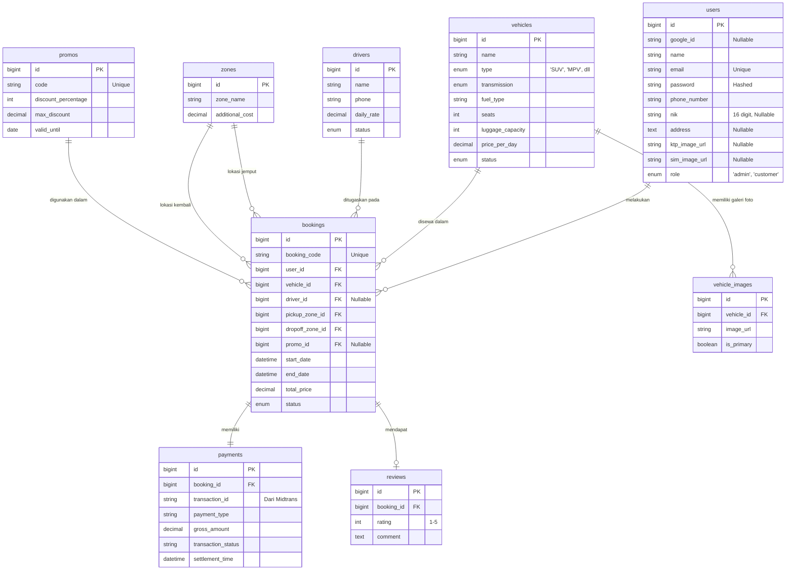

# 🚗 KlikRental - Sistem Informasi Manajemen Rental Kendaraan

**KlikRental** adalah platform manajemen persewaan kendaraan berbasis web yang dirancang untuk mendigitalisasi operasional UMKM rental. Sistem ini menggunakan **Laravel 13** dengan arsitektur modern untuk menangani fitur-fitur kompleks seperti otomasi pengingat, pembayaran digital, dan kalkulasi harga dinamis.

---

## 🌐 Live Demo & Deployment
Sistem ini telah di-deploy ke server produksi dan diperbarui secara otomatis menggunakan pipeline CI/CD (Continuous Integration / Continuous Deployment).

👉 **[Coba KlikRental Live Demo!](https://klikrental.widihhh.my.id/)**

---

## 📑 Software Requirements Specification (SRS)

### 1. Latar Belakang Sistem
Saat ini, banyak UMKM di bidang rental kendaraan masih mengelola kegiatan operasionalnya secara manual (buku/Excel) dan via pesan WhatsApp. Metode manual ini sering kali menimbulkan berbagai kendala operasional, seperti risiko hilangnya data pelanggan, bentrok jadwal sewa (*double-booking*), kesulitan dalam mengkalkulasi tarif tambahan (supir/zona), hingga rentannya *human error* dalam pengelolaan data.

### 2. Tujuan Pengembangan
Sistem ini dirancang untuk mendigitalisasi seluruh proses operasional rental, meliputi:
- Memfasilitasi proses pemesanan (*booking*) kendaraan secara *online* dan *real-time*.
- Mengotomatisasi kalkulasi biaya sewa, termasuk opsi tambahan (layanan supir dan biaya zona lokasi).
- Mengintegrasikan sistem pembayaran digital (Payment Gateway) untuk verifikasi transaksi otomatis.
- Menerapkan sistem notifikasi dan pengingat otomatis menggunakan *workflow automation*.

### 3. Spesifikasi Pengguna (Stakeholder)
- **Admin (Pengelola Rental):** Memiliki hak akses penuh untuk mengelola master data kendaraan, memantau ketersediaan armada, melihat laporan, dan mengelola tarif.
- **Pelanggan (Customer):** Pengguna publik yang dapat melihat katalog, melakukan pendaftaran/login, memilih opsi penyewaan, dan membayar mandiri.

### 4. Fitur Utama Sistem
- **Modul Katalog & Reservasi:** Menampilkan armada lengkap (jumlah *seat*, kapasitas bagasi).
- **Dynamic Pricing & Opsi Tambahan:** Kalkulasi otomatis berdasarkan durasi, zona lokasi antar-jemput, dan supir.
- **Payment Gateway Integration:** Pembayaran via QRIS/Virtual Account dengan verifikasi otomatis.
- **Sistem Notifikasi Pintar (n8n):** Pengiriman WA otomatis untuk konfirmasi pembayaran dan pengingat pengembalian kendaraan pada J-2 (2 Jam sebelum waktu sewa habis).
- **Google OAuth Login:** Fasilitas *login/register* instan menggunakan akun Google.

### 5. Kebutuhan Fungsional
| ID | Deskripsi Kebutuhan |
| :--- | :--- |
| **F-01** | Sistem harus menampilkan status ketersediaan armada secara *real-time*. |
| **F-02** | Sistem menolak *booking* pada kendaraan yang jadwalnya sudah terisi (*double-booking protection*). |
| **F-03** | Kalkulasi harga dengan rumus: `(Harga Sewa + Biaya Supir) x Durasi + Biaya Zona`. |
| **F-04** | Mengubah status pesanan otomatis menjadi *Paid* saat menerima *webhook* Payment Gateway. |
| **F-05** | Sistem mengirimkan notifikasi WhatsApp konfirmasi pembayaran berhasil via n8n. |
| **F-06** | Sistem mendeteksi sisa waktu 2 Jam (J-2) dan mengirimkan WA pengingat pengembalian. |
| **F-07** | *Dashboard* Admin untuk CRUD data armada, zona, driver, promo, dan riwayat transaksi. |

### 6. Kebutuhan Non-Fungsional
| ID | Deskripsi Kebutuhan |
| :--- | :--- |
| **NF-01** | **Keamanan Data:** Password dienkripsi menggunakan *Hashing* (Bcrypt). |
| **NF-02** | **Responsivitas:** UI/UX responsif untuk perangkat Mobile dan Desktop. |
| **NF-03** | **Environment & CI/CD:** Sistem di-hosting menggunakan *Custom Docker* di CasaOS dengan pipeline integrasi *Webhook* n8n untuk *auto-deployment*. |

---

## 🛠️ Tech Stack & Infrastructure

- **Framework:** Laravel 13 (PHP 8.4 FPM)
- **Database:** MySQL 8.0
- **Frontend:** Laravel Blade, Tailwind CSS / Bootstrap, Vite
- **Automation & CI/CD:** n8n Workflow Automation (Auto-Deploy via GitHub Webhooks)
- **Payment Gateway:** Midtrans (Sandbox Environment)
- **Infrastructure:** Docker Compose (App, Nginx, DB) on CasaOS

---

## 🚀 Progres Pembaruan Terbaru (Fase Customer & Booking Engine)

### 1. Pembaruan Struktur Database (Migration & Model)
- **Tabel `users` (Manajemen Profil & Identitas):**
  - Menambahkan field `nik` (16 digit, unique).
  - Menambahkan field `address` (text).
  - Menambahkan field `ktp_image_url` dan `sim_image_url` untuk keamanan operasional rental.
  - Implementasi PHP Attributes `#[Fillable]` ala Laravel 13 pada model User.
- **Tabel `vehicle_images` (Sistem Galeri Foto):**
  - Membuat tabel baru untuk mendukung relasi *One-to-Many* dengan tabel `vehicles`.
  - Memungkinkan satu mobil memiliki banyak foto (Thumbnail Utama & Galeri).

### 2. Fitur Pelanggan (Customer Journey)
- **Katalog Mobil (`/dashboard`):**
  - Menampilkan daftar mobil yang berstatus *available*.
  - Menampilkan gambar *thumbnail* utama dan deretan galeri foto untuk setiap mobil (menggunakan relasi `primaryImage` dan `images`).
- **Navigasi Dinamis:**
  - Pembaruan *Navbar* bawaan Breeze menjadi lebih ramah pelanggan dengan menu **Katalog Mobil** dan **Riwayat Pesanan**.
- **Manajemen Profil Kelengkapan Identitas:**
  - Form edit profil (`/profile`) kini mendukung *upload* file (KTP & SIM) beserta pengisian NIK dan Alamat lengkap menggunakan disk `public/storage`.

### 3. Core Engine: Form Booking & Kalkulasi Harga Real-Time
- **Live Calculation (AJAX/Fetch API):**
  - Perhitungan harga sewa otomatis tanpa perlu *refresh* halaman di halaman `booking.create`.
  - Harga dipecah secara transparan: **Harga Mobil**, **Jasa Supir** (opsional), **Biaya Zona Jemput**, dan **Biaya Zona Kembali**.
- **Sistem Diskon & Promo:**
  - Validasi kode promo secara *real-time*.
  - Memotong harga secara otomatis sesuai dengan persentase diskon (`discount_percentage`) dan dibatasi oleh nilai maksimum diskon (`max_discount`).
- **Invoice & Struk Tagihan (`/booking/{code}/detail`):**
  - Halaman rincian pesanan eksklusif untuk pelanggan.
  - Menampilkan status pesanan (Pending/Paid) dan total tagihan akhir.
  - Placeholder tombol **"Bayar Sekarang"** telah disiapkan untuk integrasi Payment Gateway.

---

## 📊 Database Schema (ERD)

## 🤝 Strategi Kontribusi (Git Flow)

Untuk menjaga kualitas kode, seluruh anggota tim wajib mengikuti aturan berikut:

1.  **Main Branch:** Hanya untuk kode yang sudah stabil dan siap dinilai (Protected).
2.  **Feature Branch:** Setiap pengerjaan tugas baru wajib membuat cabang dengan format:
      - `feat/nama-fitur` (Contoh: `feat/login-google`)
      - `ui/nama-halaman` (Contoh: `ui/katalog-mobil`)
      - `fix/nama-bug` (Contoh: `fix/kalkulasi-denda`)
3.  **Pull Request (PR):** Penggabungan ke `main` harus melalui proses Review oleh Project Manager.
4.  **Conventional Commits:** Gunakan prefix pada pesan commit:
      - `feat:` Fitur baru
      - `fix:` Perbaikan bug
      - `ui:` Perubahan tampilan
      - `docs:` Update dokumentasi/README
      - `chore:` Maintenance atau update library

---

## 👥 Tim Pengembang (Kelompok 6)

**Dosen Pengampu:** 👩‍🏫 **Maya Utami Dewi, S.Kom, M.Kom**

| Nama Lengkap | NIM | Peran (Role) |
| :--- | :--- | :--- |
| **Rahmad Widiansyah** | 1123110089 | Project Manager & System Analyst |
| **Ilham Puji Wira Pratama** | 1123110086 | Frontend Developer |
| **Iqbal Hamdani** | 1123110040 | UI/UX Designer |
| **Fengki Andriansyah** | 1123110070 | Backend Developer |

---

Copyright © 2026 - Kelompok 6 KlikRental
