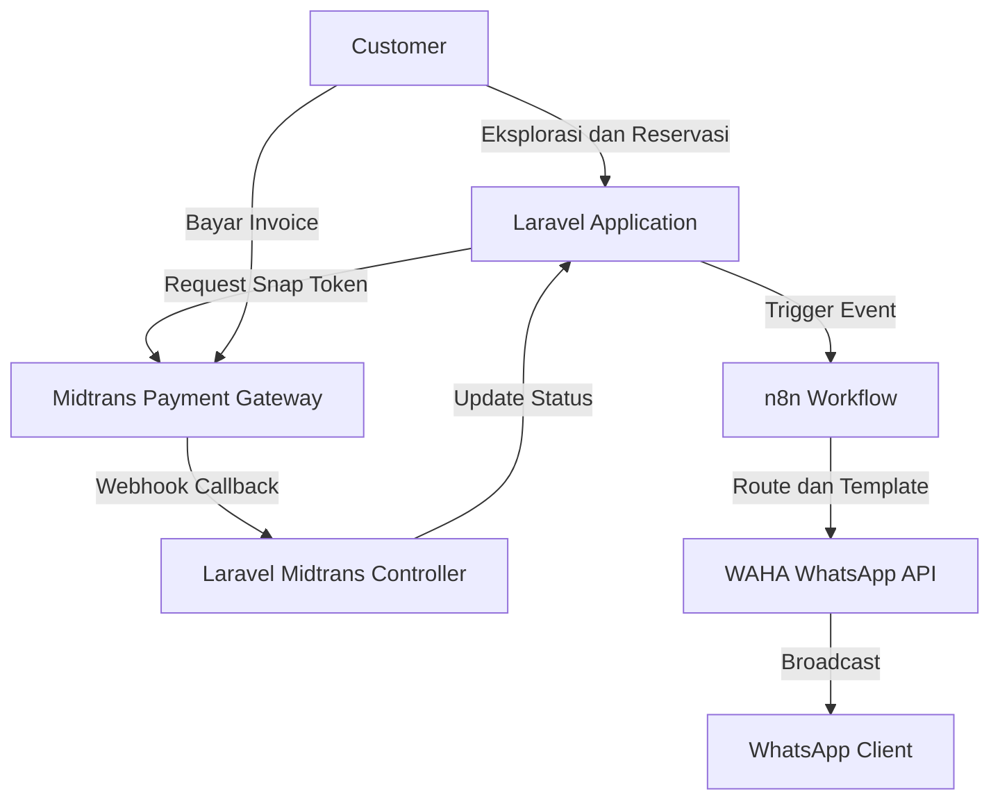
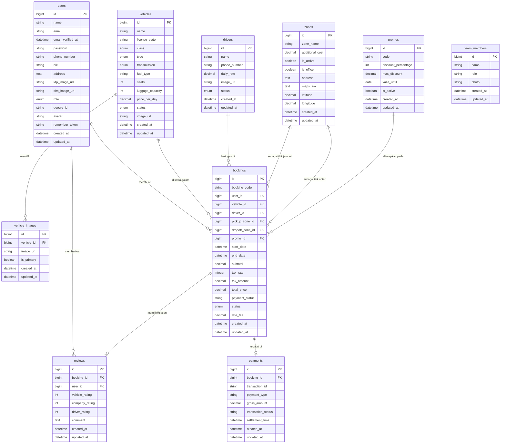
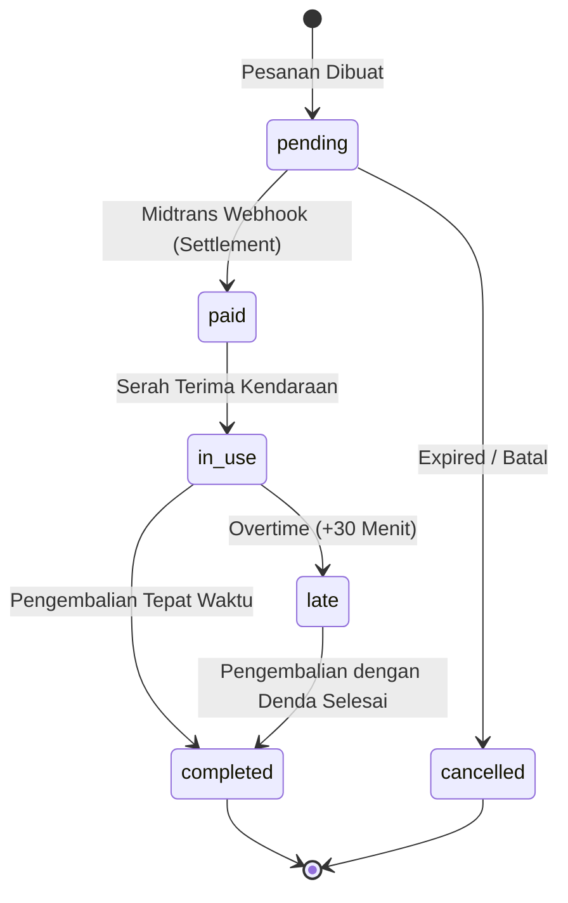
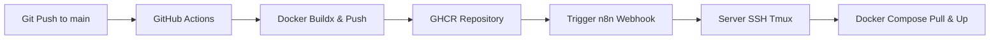

# KlikRental


## Overview

**KlikRental** adalah platform manajemen penyewaan kendaraan berbasis web yang dirancang untuk mendigitalisasi operasional UMKM rental kendaraan. Sistem ini mengotomatisasi seluruh alur bisnis, mulai dari reservasi pelanggan, kalkulasi harga dinamis (zona & promo), integrasi pembayaran digital Midtrans, hingga manajemen siklus hidup armada dan supir secara *real-time*.

Sistem ini menggunakan arsitektur *event-driven* untuk sinkronisasi inventaris dan sistem notifikasi WhatsApp asinkron melalui n8n.

## Key Features

### Customer Features

* **Vehicle Catalog & Real-Time Availability:** Katalog interaktif dengan visualisasi status *real-time* dan kalender Flatpickr yang secara otomatis me-*disable* tanggal yang telah dipesan untuk mencegah *overlap*.
* **Dynamic Pricing Engine:** Kalkulasi harga *server-side* via AJAX yang mencakup biaya sewa dasar, opsi supir, tambahan biaya zona (jemput/antar), validasi kupon promo, dan PPN 11%.
* **Driver & Zone Selection:** Pemilihan supir interaktif dengan informasi tarif harian, jumlah jam terbang, dan rata-rata *rating*. Tersedia opsi "Lepas Kunci" secara *default*.
* **Manual Cancellation:** Tombol pembatalan mandiri pada halaman detail pesanan (hanya untuk status `pending`) guna melepaskan unit kendaraan dan supir kembali ke status *available* secara instan.
* **Customer Profile (KYC):** Manajemen profil terintegrasi untuk mengumpulkan NIK, Nomor WhatsApp, serta unggahan dokumen KTP dan SIM.
* **Invoice & Countdown Timer:** Tampilan detail pesanan modern dengan *countdown timer* 60 menit untuk batas pembayaran dan integrasi pembayaran Midtrans Snap.

### Booking Features

* **Double-Booking Protection:** Mesin validasi *backend* tingkat lanjut yang mengunci ketersediaan armada dan jadwal supir secara spesifik pada rentang tanggal transaksi.
* **Automated Inventory Sync:** Menggunakan Eloquent `booted()` pada model `Booking`. Status `Vehicle` dan `Driver` berubah otomatis menjadi `rented`/`on_duty` saat pesanan `in_use`, dan kembali `available` saat pesanan `completed` atau `cancelled`.
* **Post-Rental Review:** Penilaian multi-aspek (Kendaraan, Supir, Perusahaan) yang hanya dapat diisi setelah status pesanan mencapai `completed`.

### Payment Features

* **Midtrans Snap Integration:** Integrasi *pop-up* pembayaran tanpa *redirect* halaman menggunakan Snap Token.
* **Automated Status Update:** Sinkronisasi status reservasi otomatis (`pending` -> `paid` -> `cancelled`) melalui *callback* Webhook Midtrans.
* **Expiry Protection:** Pembatalan otomatis oleh sistem jika pembayaran tidak diselesaikan dalam waktu 60 menit.

### Authentication Features

* **Google OAuth (SSO):** Pendaftaran dan login instan dengan sinkronisasi avatar otomatis.
* **Role Management:** Sistem *role-based access control* yang membedakan rute fungsional antara `admin` dan `customer`.

## Automation & Scheduler

Sistem dilengkapi dengan *Cron Job* (`booking:monitor-all`) yang memantau siklus hidup pesanan setiap menit:
* **Cleanup Expired Bookings:** Mengubah status pesanan `pending` menjadi `cancelled` jika melewati batas waktu bayar (60 menit).
* **H-30m Pickup Reminder:** Notifikasi ke pelanggan dan supir via WhatsApp.
* **H+10m Escalation:** Peringatan ke Admin jika unit belum diserahterimakan (`in_use`) tepat waktu.
* **H-2h Drop-off Reminder:** Pengingat pengembalian unit.
* **Overtime Detection:** Otomatis mengubah status ke `late` dan menghitung denda Rp 50.000/jam setelah toleransi 30 menit.

## Tech Stack

* **Framework:** Laravel 13.11.2+ (Support PHP 8.4 Property Hooks & Type Hinting)
* **Admin Panel:** Filament V4 (Next-Gen Schema Architecture)
* **Database:** MySQL 8.0
* **Frontend:** Tailwind CSS, Alpine.js, Vanilla JavaScript, Leaflet.js
* **Payment Gateway:** Midtrans
* **Authentication:** Laravel Breeze, Google OAuth
* **Containerization:** Docker
* **CI/CD:** GitHub Actions
* **Automation:** n8n, WAHA (WhatsApp HTTP API)

## System Architecture



**Alur Data Teknis:**
Pelanggan berinteraksi penuh dengan antarmuka yang disajikan oleh Laravel. Saat pelanggan memproses *checkout*, Laravel menghasilkan *Snap Token* via Midtrans API. Pelanggan membayar melalui antarmuka Snap. Midtrans kemudian mengirimkan notifikasi *Webhook* (*server-to-server*) kembali ke Laravel (`/midtrans/callback`). Berdasarkan validasi pembayaran (*Settlement*), Laravel merubah *state* `Booking` menjadi `paid`. Setiap pergerakan *state* krusial pada transaksi, Laravel mengirimkan HTTP POST (berisi *JSON Payload*) ke n8n. n8n mendistribusikan *logic routing* kondisional (seperti apakah pesanan lepas kunci atau menggunakan supir) sebelum meneruskan pesan ke layanan WAHA untuk *broadcast* notifikasi ke perangkat seluler pengguna.

## Database Overview


### Database Entity Documentation

| Entity | Purpose | Relationships |
| --- | --- | --- |
| **User** | Entitas sentral yang mencatat kredensial autentikasi dan informasi identitas operasional (KTP, SIM, NIK). Mendukung SSO via `google_id`. | `hasMany(Booking)`, `hasMany(Review)` |
| **Vehicle** | Basis data master untuk armada rental, mengatur atribut mesin, transmisi, tarif dasar harian, dan status ketersediaan. | `hasMany(VehicleImage)`, `hasMany(Booking)` |
| **VehicleImage** | Menampung aset visual majemuk dari `Vehicle` dengan dukungan *flag* `is_primary` untuk mengatur *thumbnail* utama. | `belongsTo(Vehicle)` |
| **Driver** | Entitas supir dengan tarif dan status ketersediaan. Disertakan dalam proses sewa secara opsional. | `hasMany(Booking)` |
| **Zone** | Katalog koordinat area operasional (jemput/antar) yang mendikte penambahan harga ekstra. Mendukung *flag* penanda lokasi kantor (`is_office`). | `hasMany(Booking)` |
| **Promo** | Modul pengurang harga (diskon) dengan restriksi periode aktif dan proteksi limit potongan maksimum. | `hasMany(Booking)` |
| **Booking** | Transaksi utama (*Pivot/Core*) yang menghubungkan kendaraan, supir, lokasi, dan promosi dengan siklus *state-machine* penyewaan. | `belongsTo(User, Vehicle, Driver, Zone, Promo)`, `hasMany(Payment)`, `hasOne(Review)` |
| **Payment** | Catatan rekam jejak (*Audit Trail*) aktivitas pembayaran yang bersumber dari respon pihak ketiga (Midtrans). | `belongsTo(Booking)` |
| **Review** | Mekanisme *feedback* pasca-penyewaan untuk aset, supir, dan sistem. | `belongsTo(Booking)`, `belongsTo(User)` |
| **TeamMember** | Entitas independen statis untuk mengisi data profil staf/kelompok pada antarmuka *Landing Page* (Tentang Kami). | - |

## Admin Panel Features

Sistem *back-office* dibangun menggunakan arsitektur **Filament V4 Schema** yang modern, menampung fungsi operasional berikut:

* **Booking Management:** 
    * **Smart Creation:** Form pembuatan cerdas dengan kalkulasi biaya otomatis (AJAX) dan integrasi zona jemput kantor otomatis.
    * **Contextual Editing:** Mode edit yang disederhanakan; mengunci identitas pelanggan dan kendaraan untuk integritas data keuangan, namun tetap mengizinkan perubahan supir dan status operasional.
* **Vehicle Resource:** Pengelolaan inventaris armada yang mendukung galeri visual *Repeater* dan kapabilitas pembuatan Plat Nomor (format H) acak apabila dibiarkan kosong.
* **Driver Resource:** Manajemen mitra supir dilengkapi metode *fallback image* berbasis `UI-Avatars` otomatis.
* **Promo Resource:** Modul kreasi kupon promosi yang menetapkan persentase diskon (`discount_percentage`) sekaligus fitur *capping* nominal maksimal (`max_discount`) dan masa berlaku.
* **Zone Resource:** Pengaturan area layanan dengan pemicu ubah status interaktif (*Toggle Column*) untuk status `is_office` dan `is_active`.
* **Team Resource:** Entitas CRUD pendukung UI publik.
* **Advanced Analytics Dashboard:** 
    * **Revenue Chart:** Analisis pendapatan real-time hanya dari transaksi sukses.
    * **Inventory Ratios:** Pantau unit yang tersedia vs disewa via Doughnut Chart.
* **Widget: Latest Booking:** Tabel mutasi lima transaksi masuk terbaru.

## Booking Lifecycle



**Penjelasan Siklus Aktif (Lifecycle Changes):**

1. **`pending`**: Status pasif menunggu otorisasi dana.
2. **`paid`**: Pembayaran diterima, armada dikunci untuk tanggal tersebut.
3. **`in_use`**: *Triggered* saat admin menandai penyerahan armada. **Automasi Inventaris**: Mengubah status `Vehicle` menjadi `rented` dan `Driver` menjadi `on_duty`.
4. **`late`**: Pemicu otomatis dari mesin *Scheduler* latar belakang apabila pengembalian melampaui toleransi 30 menit. Sistem merumuskan taksiran `late_fee`.
5. **`completed` / `cancelled**`: Terminal *state*. **Automasi Inventaris**: Mengembalikan kondisi logis `Vehicle` dan `Driver` ke `available`.

## Payment Integration

Aplikasi mengadopsi integrasi **Midtrans Snap** dengan sistem *webhook* otomatis:
1. **Payment Bridge:** Sinkronisasi status pembayaran Midtrans ke Eloquent Model `Booking`.
2. **Transaction Audit:** Rekam jejak `transaction_id` dan `payment_type` pada tabel `payments` untuk rekonsiliasi keuangan.

## Notification System

Sistem menerapkan siklus tertutup Midtrans melalui arsitektur berikut:

* **Midtrans Snap:** Skrip *client-side* dipanggil pada saat peninjauan halaman `booking.show` untuk memunculkan modal tagihan.
* **Webhook (`/midtrans/callback`):** *Endpoint* terbuka (via Route POST) yang menangkap *push update* untuk *Capture*, *Settlement*, maupun *Expire*.
* **Status Settlement:** Validasi yang memicu perpindahan pesanan pelanggan dari `pending` menuju `paid`.

## Notification Automation

Aplikasi mengalihdayakan mekanisme pengiriman ke *workflow engine* n8n. Kejadian (*events*) berikut ditransmisikan secara independen:

* **`booking_paid`**: Konfirmasi *Settlement* sukses dikirimkan ke Pelanggan. Memuat penugasan terpisah untuk Supir (bila menggunakan).
* **`booking_pickup_reminder`**: H-30 menit sebelum jadwal temu. Dikirim spesifik kepada Driver atau Pelanggan.
* **`booking_pickup_escalation`**: H+10 menit teguran merah bagi operasional Admin ketika status kendaraan enggan bergeser menjadi `in_use`.
* **`booking_reminder_2_hours`**: H-2 Jam alarm waktu persiapan kepulangan bagi penyewa.
* **`booking_late`**: Laporan kalkulasi denda otomatis (Overtime) per-jam yang ditembakkan paska toleransi jadwal.

**Arsitektur Notifikasi:**
`Laravel HTTP (POST)` ➔ `n8n Webhook Node` ➔ `Switch/Routing Node (Cek Tipe Event)` ➔ `WAHA Instance` ➔ `WhatsApp (c.us)`

### Localization & User Experience

* **Indonesian Native:** Seluruh antarmuka Admin Panel dan pesan validasi telah dilokalisasi sepenuhnya ke Bahasa Indonesia.
* **Interactive Map Integration:** Menggunakan Leaflet.js dengan fitur *bounding box* yang dikunci untuk area Semarang, memudahkan pencarian lokasi kantor cabang.
* **Intelligent Avatars:** Integrasi otomatis dengan Google OAuth Avatar. Jika tidak ada, sistem akan melakukan *fallback* ke `UI-Avatars` berdasarkan inisial nama.
* **Dynamic Pricing Engine (AJAX):** Kalkulasi harga dilakukan via *endpoint* API untuk mencegah manipulasi data di sisi klien.
* **Intelligent Avatars:** Integrasi UI-Avatars sebagai *fallback* otomatis jika pengguna atau supir tidak memiliki foto profil.
* **Mobile-First Navigation:** Navigasi adaptif dengan *Bottom Navigation Bar* untuk pengalaman aplikasi *native* pada perangkat seluler.
* **Tailwind CSS Variable Theme:** Manajemen tema (Terang/Gelap) menggunakan variabel CSS murni untuk performa maksimal.
* **Real-Time Operational Alerts:** Sistem memiliki alur eskalasi otomatis (via n8n) ke Admin jika terjadi keterlambatan serah terima kendaraan (>10 menit).

### Automation & Scheduler

Sistem dilengkapi dengan *Cron Job* (`booking:monitor-all`) yang memantau siklus hidup pesanan setiap menit:
* **H-30m Pickup Reminder:** Notifikasi ke pelanggan dan supir.
* **H+10m Escalation:** Peringatan ke Admin jika status belum bergeser ke `in_use`.
* **H-2h Drop-off Reminder:** Pengingat waktu pengembalian.
* **Overtime Detection:** Otomatis mengubah status ke `late` (setelah 30 menit toleransi) dan menghitung denda Rp 50.000/jam.

## Authentication & Authorization

* **Laravel Auth:** Alur masuk *Stateful* via `breeze` yang dimodifikasi. Mewajibkan kolom `phone_number` demi operasional bot notifikasi.
* **Google OAuth:** Sinkronisasi *Single Sign-On* via penyedia layanan Google yang mencocokkan kredensial secara instan tanpa proses formulir registrasi.
* **Role Management:** Filter level persetujuan `admin` dan `customer` untuk menjaga gerbang akses *backend* administrasi Filament dan rute dasbor pemesanan personal.

## Development Setup

Kebutuhan sistem: PHP 8.4, Composer, Node.js, MySQL.

1. Lakukan duplikasi repositori dan kompilasi dependensi:

```bash
composer install
npm install

```

2. Modifikasi sistem parameter dasar:

```bash
cp .env.example .env
php artisan key:generate

```

3. Bangun *schema* relasi dan ikat aset direktori:

```bash
php artisan migrate
php artisan storage:link

```

4. Susun *bundle assets* (*Tailwind, Vite*) dan operasikan *Server Dev*:

```bash
npm run build
php artisan serve

```

## Scheduler Setup

Sistem rental mensyaratkan utilitas latar belakang konstan:

```bash
php artisan schedule:run

```

Menjalankan perintah utama di bawah ini setiap satu menit:

* **`php artisan booking:monitor-all`**: Mesin *Cron Job* sentral penyedia deteksi H-30 menit (*Pick Up*), H+10 menit (*Escalation*), H-2 Jam (*Drop Off*), dan penjatuhan presisi denda *Overtime* secara komprehensif.

## Docker Deployment

Struktur *Deployment* Produksi dipaketkan melalui CasaOS / Docker Compose.

* **Dockerfile:** Mengeksekusi instruksi pembentukan kontainer ringan Nginx & PHP-FPM, disisipkan dengan arahan *smart CMD* manipulasi perizinan struktur direktori (`chown` pada `/storage`) serta *route caching*.
* **Docker Compose (`docker-compose.yml`):**
* `app`: Mengisolasi fungsional aplikasi utama (Internal web-server).
* `mysql`: RDBMS basis data terpisah.


* **Volumes:** Bind-mount `/var/www/storage` ditujukan menjaga imunitas data lampiran sistem pelanggan dari siklus pembaharuan kontainer.

## CI/CD Pipeline

Menganut arsitektur penggelaran tanpa sentuhan (*Zero-Touch Deployment*).



**Proses Pipeline:**
Pembaruan kode pada *branch* utama memantik inisialisasi GitHub Actions. Runner akan melakukan kompilasi Composer/NPM pada lingkungan tersendiri dan menerbitkannya sebagai *immutable image* di GitHub Container Registry (GHCR). Saat siap, sebuah beban Webhook dikirim ke n8n internal peladen (*server*). Melalui sub-proses SSH Tmux, n8n menarik (pull) dan menyuntikkan kontainer baru ke dalam sirkulasi tanpa jeda panjang, lalu memancarkan notifikasi pembaruan berhasil ke Tim Pengembang via WA/Telegram.

## Architecture Findings

Berdasarkan *technical audit*, repositori ini menduduki beberapa *technical debt* yang perlu diatensi:

* **`Booking` & `Promo` Model Mismatch:** Sinkronisasi properti `$fillable` dengan struktur database riil.
* **Payment Integration Note:** Payment Controller / Webhook Midtrans belum sepenuhnya terikat ke Model Eloquent secara eksplisit pada lapisan data. (Saran: Implementasikan relasi `hasOne(Payment::class)` di `Booking` Model dan `belongsTo(Booking::class)` di `Payment` Model.)
* **Security - Webhook n8n:** Menambahkan `X-N8N-SECRET` header pada transmisi data.
* **Bilingual Inconsistency:** Halaman rute *edge-case* Breeze (`verify-email`, `reset-password`) gagal melokalisasi teks (*hardcoded locale fallback* EN). (Saran: Tambahkan terjemahan bahasa Indonesia untuk rute-rute ini dan atur `APP_LOCALE` di `.env` ke `id`.)

## Known Limitations

* **Absennya Kalkulasi Panel Admin:** Logika kalkulasi telah dipindah ke Model `Booking::calculatePricing()` agar bisa digunakan di Admin Panel.
* **Inkonsistensi Migrasi Profil SSO:** Restrukturisasi berulang pada properti migrasi tabel entitas `users` mengakibatkan beberapa avatar dari akun Google Auth SSO mengalami asinkronisasi. (Saran: Pastikan hanya ada satu kolom `avatar` di tabel `users` dan `GoogleController` menggunakannya.)
* **Restriksi CSS Tema Dasar:** Eksekusi skema desain UI diinjeksikan dinamis via Variabel CSS dasar (untuk transisi tema Terang/Gelap). Pewarnaan dasar (*Primary Colors*) tidak diprogram terpisah dalam utilitas ekosistem konfigurasi *Tailwind*, sehingga modifikasi korporat memerlukan pengeditan manual tag khusus `<style>` di tata letak akar. (Saran: Pertimbangkan untuk memindahkan konfigurasi warna utama ke `tailwind.config.js` untuk kemudahan modifikasi.)

## Roadmap

Pengembangan terstruktur yang disarankan sejalan dengan arsitektur masa kini:

* **Payment Reconciliation:** Restrukturisasi UI integrasi silang guna memantau anomali keuangan berdasarkan `settlement_time` (*Midtrans*) selaras dengan dasbor Filament Admin.
* **Health Check Endpoint:** [DONE] Integrasi mekanisme *ping/HTTP 200* via `/api/health`.
* **Notification Monitoring:** Dasbor agregat pemantauan lalu-lintas `WAHA` internal untuk melacak status pesan yang gagal terkirim (Nomor *Customer* hangus).
* **Driver Mobile Workflow:** Aplikasi *Web-App* minimalis interaktif yang mengizinkan *Driver* mengubah *state* logis penugasannya (Mulai Tugas & Selesai) demi menggeser beban intervensi Admin *back-office*.
* **Multi-Branch Operational Dashboard:** Restriksi wewenang antara pimpinan `Admin` dan pekerja cabang `Staff` (untuk sinkronisasi properti `is_office`).