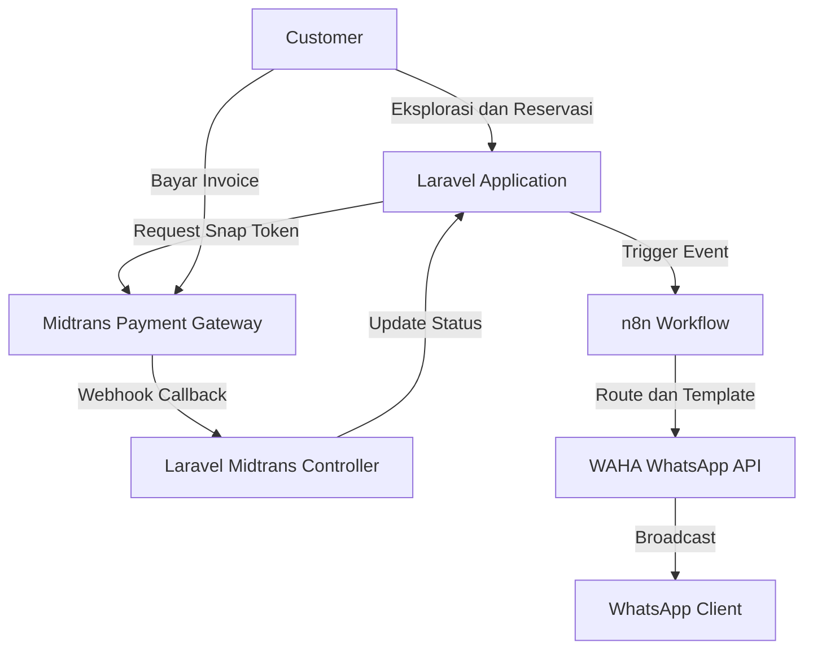
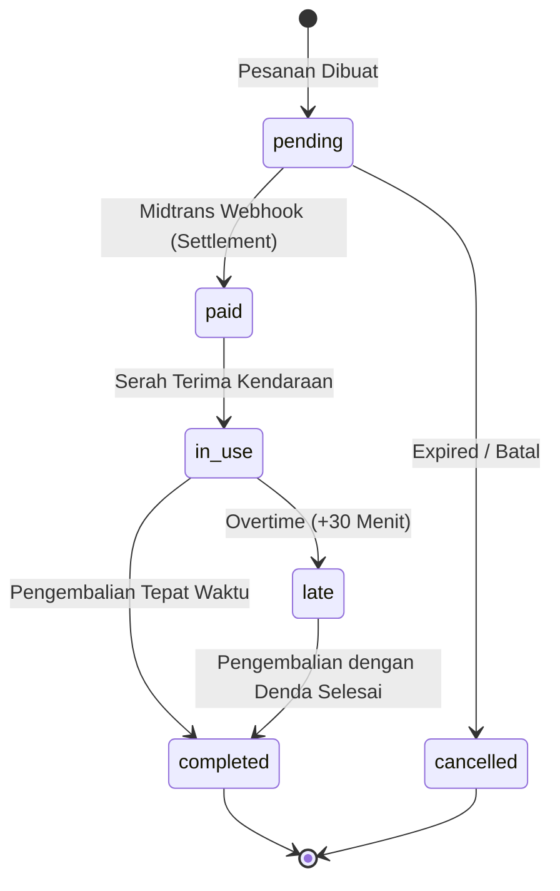
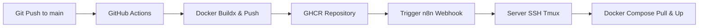

# KlikRental

## Overview

**KlikRental** adalah platform manajemen penyewaan kendaraan berbasis web berskala enterprise yang dirancang untuk mendigitalisasi dan mengotomatisasi operasional UMKM rental kendaraan. Sistem ini memfasilitasi pemesanan pelanggan, alokasi inventaris, kalkulasi harga dinamis, verifikasi pembayaran digital, hingga manajemen siklus hidup penyewaan dari awal hingga pengembalian.

Ruang lingkup sistem berfokus pada efisiensi manajerial *back-office* dan pengalaman mandiri pelanggan. Target pengguna terbagi menjadi **Customer** (penyewa publik) yang melakukan reservasi melalui *front-end* dan **Admin** (pengelola operasional) yang mengawasi armada dan transaksi melalui Dasbor Filament. Proses bisnis mencakup katalogisasi inventaris, transaksi pemesanan ganda (dengan/tanpa supir), perhitungan zona jemput/antar, integrasi gerbang pembayaran, dan orkestrasi notifikasi asinkron berbasis *event*.

## Key Features

### Customer Features

* **Vehicle Catalog & Real-Time Availability:** Katalog interaktif dengan visualisasi status *real-time* dan kalender Flatpickr yang secara otomatis me-*disable* tanggal yang telah dipesan untuk mencegah *overlap*.
* **Dynamic Pricing (AJAX):** Perhitungan harga *real-time* yang merangkum biaya sewa dasar, opsi supir, tambahan zona lokasi (jemput/antar), potongan promo, dan perhitungan otomatis PPN 11%.
* **Driver & Zone Selection:** Pemilihan supir interaktif dengan informasi tarif harian, jumlah jam terbang, dan rata-rata *rating*. Tersedia opsi "Lepas Kunci" secara *default*.
* **Promo Validation:** Validasi kode promo seketika yang membatasi nilai potong melalui sistem batas maksimal diskon (*capping*).
* **Customer Profile (KYC):** Manajemen profil komprehensif terintegrasi dengan persyaratan operasional, mengumpulkan NIK (16 digit), Nomor WhatsApp valid, KTP, dan SIM.
* **Booking History:** Dasbor riwayat penyewaan pribadi dengan representasi antarmuka adaptif (Card untuk Mobile, Table untuk Desktop).

### Booking Features

* **Double-Booking Protection:** Mesin validasi *backend* tingkat lanjut yang mengunci ketersediaan armada dan jadwal supir secara spesifik pada rentang tanggal transaksi.
* **Review Submission:** Penilaian pasca-penyewaan multi-aspek (Kondisi Kendaraan, Pelayanan Perusahaan, dan Kinerja Supir).

### Payment Features

* **Midtrans Snap Integration:** *Pop-up* tagihan *on-the-fly* tanpa perlu perpindahan rute URL.
* **Automated Status Update:** Sinkronisasi status reservasi internal (*pending* ke *paid*) secara instan menerima *callback* dari *Webhook* Midtrans.

### Authentication Features

* **Google OAuth (SSO):** Pendaftaran akun dan akses login instan yang terhubung langsung dengan integrasi *avatar* profil pengguna.
* **Role Management:** Sistem *role-based access control* yang membedakan rute fungsional antara `admin` dan `customer`.

### Notification Features

* **Event-Driven Messaging:** Infrastruktur pengiriman *webhook* asinkron untuk mentransmisikan status siklus pesanan kepada *Customer*, *Driver*, dan *Admin* melalui WhatsApp (via n8n).

## Tech Stack

* **Framework:** Laravel 13.x / PHP 8.4
* **Admin Panel:** Filament V4
* **Database:** MySQL 8.0
* **Frontend:** Tailwind CSS, Alpine.js, Vanilla JavaScript, Leaflet.js
* **Payment Gateway:** Midtrans
* **Authentication:** Laravel Breeze, Google OAuth
* **Containerization:** Docker
* **CI/CD:** GitHub Actions
* **Automation:** n8n, WAHA (WhatsApp HTTP API)

## System Architecture



**Alur Data Teknis:**
Pelanggan berinteraksi penuh dengan antarmuka yang disajikan oleh Laravel. Saat pelanggan memproses *checkout*, Laravel menghasilkan *Snap Token* via Midtrans API. Pelanggan membayar melalui antarmuka Snap. Midtrans kemudian mengirimkan notifikasi *Webhook* (*server-to-server*) kembali ke Laravel (`/midtrans/callback`). Berdasarkan validasi pembayaran (*Settlement*), Laravel merubah *state* `Booking` menjadi `paid`. Setiap pergerakan *state* krusial pada transaksi, Laravel mengirimkan HTTP POST (berisi *JSON Payload*) ke n8n. n8n mendistribusikan *logic routing* kondisional (seperti apakah pesanan lepas kunci atau menggunakan supir) sebelum meneruskan pesan ke layanan WAHA untuk *broadcast* notifikasi ke perangkat seluler pengguna.

## Database Overview
erDiagram
```
    users {
        bigint id PK
        string name
        string email
        datetime email_verified_at
        string password
        string phone_number
        string nik
        text address
        string ktp_image_url
        string sim_image_url
        enum role
        string google_id
        string avatar
        string remember_token
        datetime created_at
        datetime updated_at
    }

    vehicles {
        bigint id PK
        string name
        string license_plate
        enum class
        enum type
        enum transmission
        string fuel_type
        int seats
        int luggage_capacity
        decimal price_per_day
        enum status
        string image_url
        datetime created_at
        datetime updated_at
    }

    vehicle_images {
        bigint id PK
        bigint vehicle_id FK
        string image_url
        boolean is_primary
        datetime created_at
        datetime updated_at
    }

    zones {
        bigint id PK
        string zone_name
        decimal additional_cost
        boolean is_active
        boolean is_office
        text address
        text maps_link
        decimal latitude
        decimal longitude
        datetime created_at
        datetime updated_at
    }

    drivers {
        bigint id PK
        string name
        string phone_number
        decimal daily_rate
        string image_url
        enum status
        datetime created_at
        datetime updated_at
    }
    
    promos {
        bigint id PK
        string code
        int discount_percentage
        decimal max_discount
        date valid_until
        boolean is_active
        datetime created_at
        datetime updated_at
    }

    bookings {
        bigint id PK
        string booking_code
        bigint user_id FK
        bigint vehicle_id FK
        bigint driver_id FK
        bigint pickup_zone_id FK
        bigint dropoff_zone_id FK
        bigint promo_id FK
        datetime start_date
        datetime end_date
        decimal subtotal
        integer tax_rate
        decimal tax_amount
        decimal total_price
        string payment_status
        enum status
        decimal late_fee
        datetime created_at
        datetime updated_at
    }

    payments {
        bigint id PK
        bigint booking_id FK
        string transaction_id
        string payment_type
        decimal gross_amount
        string transaction_status
        datetime settlement_time
        datetime created_at
        datetime updated_at
    }

    reviews {
        bigint id PK
        bigint booking_id FK
        bigint user_id FK
        int vehicle_rating
        int company_rating
        int driver_rating
        text comment
        datetime created_at
        datetime updated_at
    }

    team_members {
        bigint id PK
        string name
        string role
        string photo
        datetime created_at
        datetime updated_at
    }

    users ||--o{ bookings : "membuat"
    users ||--o{ reviews : "memberikan"
    vehicles ||--o{ vehicle_images : "memiliki"
    vehicles ||--o{ bookings : "disewa dalam"
    drivers ||--o{ bookings : "bertugas di"
    zones ||--o{ bookings : "sebagai titik jemput"
    zones ||--o{ bookings : "sebagai titik antar"
    promos ||--o{ bookings : "diterapkan pada"
    bookings ||--o| payments : "tercatat di"
    bookings ||--o| reviews : "memiliki ulasan"

```

### Database Entity Documentation

| Entity | Purpose | Relationships |
| --- | --- | --- |
| **User** | Entitas sentral yang mencatat kredensial autentikasi dan informasi identitas operasional (KTP, SIM, NIK). Mendukung SSO via `google_id`. | `hasMany(Booking)`, `hasMany(Review)` |
| **Vehicle** | Basis data master untuk armada rental, mengatur atribut mesin, transmisi, tarif dasar harian, dan status ketersediaan. | `hasMany(VehicleImage)`, `hasMany(Booking)` |
| **VehicleImage** | Menampung aset visual majemuk dari `Vehicle` dengan dukungan *flag* `is_primary` untuk mengatur *thumbnail* utama. | `belongsTo(Vehicle)` |
| **Driver** | Entitas supir dengan tarif dan status ketersediaan. Disertakan dalam proses sewa secara opsional. | `hasMany(Booking)` |
| **Zone** | Katalog koordinat area operasional (jemput/antar) yang mendikte penambahan harga ekstra. Mendukung *flag* penanda lokasi kantor (`is_office`). | `hasMany(Booking)` |
| **Promo** | Modul pengurang harga (diskon) dengan restriksi periode aktif dan proteksi limit potongan maksimum. | `hasMany(Booking)` |
| **Booking** | Transaksi utama (*Pivot/Core*) yang menghubungkan kendaraan, supir, lokasi, dan promosi dengan siklus *state-machine* penyewaan. | `belongsTo(User, Vehicle, Driver, Zone, Promo)`, `hasMany(Payment)`, `hasOne(Review)` |
| **Payment** | Catatan rekam jejak (*Audit Trail*) aktivitas pembayaran yang bersumber dari respon pihak ketiga (Midtrans). | `belongsTo(Booking)` |
| **Review** | Mekanisme *feedback* pasca-penyewaan, menampung nilai terpisah untuk aset, supir, dan sistem. | `belongsTo(Booking)`, `belongsTo(User)` |
| **TeamMember** | Entitas independen statis untuk mengisi data profil staf/kelompok pada antarmuka *Landing Page* (Tentang Kami). | - |

## Admin Panel Features

Sistem *back-office* dibangun secara holistik di atas Filament V4, menampung fungsi operasional operasional berikut:

* **Booking Resource:** Manajemen daur hidup pesanan dengan fitur pencarian pintar menembus relasi tabel (pencarian via Plat/Nama Mobil) dan *Inline Editing* pengubahan status *Booking* secara instan.
* **Vehicle Resource:** Pengelolaan inventaris armada yang mendukung galeri visual *Repeater* dan kapabilitas pembuatan Plat Nomor (format H) acak apabila dibiarkan kosong.
* **Driver Resource:** Manajemen mitra supir dilengkapi metode *fallback image* berbasis `UI-Avatars` otomatis.
* **Promo Resource:** Modul kreasi kupon promosi yang menetapkan persentase diskon (`discount_percentage`) sekaligus fitur *capping* nominal maksimal (`max_discount`).
* **Zone Resource:** Pengaturan area layanan dengan pemicu ubah status interaktif (*Toggle Column*) untuk status `is_office` dan `is_active`.
* **Team Resource:** Entitas CRUD pendukung UI publik.
* **Widget: Stats Overview:** Kartu metrik cepat (*Quick Shortcut*) ke Order Hari Ini, Order Dibayar, dan Mobil Disewa.
* **Widget: Revenue Chart:** Visualisasi grafik analisis pendapatan yang difilter spesifik hanya memproses transaksi berstatus `completed`.
* **Widget: Vehicle Status:** Bagan rasio *real-time* ketersediaan unit armada (*Doughnut Chart*).
* **Widget: Latest Booking:** Tabel mutasi lima transaksi masuk terbaru.

## Booking Lifecycle



**Penjelasan Siklus Aktif (Lifecycle Changes):**

1. **`pending`**: Status pasif menunggu otorisasi dana.
2. **`paid`**: Pembayaran diterima, armada dikunci untuk tanggal tersebut.
3. **`in_use`**: *Triggered* saat admin menandai penyerahan armada. **Automasi Inventaris**: Mengubah status `Vehicle` menjadi `rented` dan `Driver` menjadi `on_duty`.
4. **`late`**: Pemicu otomatis dari mesin *Scheduler* latar belakang apabila pengembalian melampaui toleransi 30 menit. Sistem merumuskan taksiran `late_fee`.
5. **`completed` / `cancelled**`: Terminal *state*. **Automasi Inventaris**: Mengembalikan kondisi logis `Vehicle` dan `Driver` ke `available`.

## Payment Integration

Sistem menerapkan siklus tertutup Midtrans melalui arsitektur berikut:

* **Midtrans Snap:** Skrip *client-side* dipanggil pada saat peninjauan halaman `booking.show` untuk memunculkan modal tagihan.
* **Webhook (`/midtrans/callback`):** *Endpoint* terbuka (via Route POST) yang menangkap *push update* untuk *Capture*, *Settlement*, maupun *Expire*.
* **Status Settlement:** Validasi yang memicu perpindahan pesanan pelanggan dari `pending` menuju `paid`.

## Notification Automation

Aplikasi mengalihdayakan mekanisme pengiriman ke *workflow engine* n8n. Kejadian (*events*) berikut ditransmisikan secara independen:

* **`booking_paid`**: Konfirmasi *Settlement* sukses dikirimkan ke Pelanggan. Memuat penugasan terpisah untuk Supir (bila menggunakan).
* **`booking_pickup_reminder`**: H-30 menit sebelum jadwal temu. Dikirim spesifik kepada Driver atau Pelanggan.
* **`booking_pickup_escalation`**: H+10 menit teguran merah bagi operasional Admin ketika status kendaraan enggan bergeser menjadi `in_use`.
* **`booking_reminder_2_hours`**: H-2 Jam alarm waktu persiapan kepulangan bagi penyewa.
* **`booking_late`**: Laporan kalkulasi denda otomatis (Overtime) per-jam yang ditembakkan paska toleransi jadwal.

**Arsitektur Notifikasi:**
`Laravel HTTP (POST)` ➔ `n8n Webhook Node` ➔ `Switch/Routing Node (Cek Tipe Event)` ➔ `WAHA Instance` ➔ `WhatsApp (c.us)`

## Authentication & Authorization

* **Laravel Auth:** Alur masuk *Stateful* via `breeze` yang dimodifikasi. Mewajibkan kolom `phone_number` demi operasional bot notifikasi.
* **Google OAuth:** Sinkronisasi *Single Sign-On* via penyedia layanan Google yang mencocokkan kredensial secara instan tanpa proses formulir registrasi.
* **Role Management:** Filter level persetujuan `admin` dan `customer` untuk menjaga gerbang akses *backend* administrasi Filament dan rute dasbor pemesanan personal.

## Development Setup

Kebutuhan sistem: PHP 8.4, Composer, Node.js, MySQL.

1. Lakukan duplikasi repositori dan kompilasi dependensi:

```bash
composer install
npm install

```

2. Modifikasi sistem parameter dasar:

```bash
cp .env.example .env
php artisan key:generate

```

3. Bangun *schema* relasi dan ikat aset direktori:

```bash
php artisan migrate
php artisan storage:link

```

4. Susun *bundle assets* (*Tailwind, Vite*) dan operasikan *Server Dev*:

```bash
npm run build
php artisan serve

```

## Scheduler Setup

Sistem rental mensyaratkan utilitas latar belakang konstan:

```bash
php artisan schedule:run

```

Menjalankan perintah utama di bawah ini setiap satu menit:

* **`php artisan booking:monitor-all`**: Mesin *Cron Job* sentral penyedia deteksi H-30 menit (*Pick Up*), H+10 menit (*Escalation*), H-2 Jam (*Drop Off*), dan penjatuhan presisi denda *Overtime* secara komprehensif.

## Docker Deployment

Struktur *Deployment* Produksi dipaketkan melalui CasaOS / Docker Compose.

* **Dockerfile:** Mengeksekusi instruksi pembentukan kontainer ringan Nginx & PHP-FPM, disisipkan dengan arahan *smart CMD* manipulasi perizinan struktur direktori (`chown` pada `/storage`) serta *route caching*.
* **Docker Compose (`docker-compose.yml`):**
* `app`: Mengisolasi fungsional aplikasi utama (Internal web-server).
* `mysql`: RDBMS basis data terpisah.


* **Volumes:** Bind-mount `/var/www/storage` ditujukan menjaga imunitas data lampiran sistem pelanggan dari siklus pembaharuan kontainer.

## CI/CD Pipeline

Menganut arsitektur penggelaran tanpa sentuhan (*Zero-Touch Deployment*).



**Proses Pipeline:**
Pembaruan kode pada *branch* utama memantik inisialisasi GitHub Actions. Runner akan melakukan kompilasi Composer/NPM pada lingkungan tersendiri dan menerbitkannya sebagai *immutable image* di GitHub Container Registry (GHCR). Saat siap, sebuah beban Webhook dikirim ke n8n internal peladen (*server*). Melalui sub-proses SSH Tmux, n8n menarik (pull) dan menyuntikkan kontainer baru ke dalam sirkulasi tanpa jeda panjang, lalu memancarkan notifikasi pembaruan berhasil ke Tim Pengembang via WA/Telegram.

## Architecture Findings

Berdasarkan *technical audit*, repositori ini menduduki beberapa *technical debt* yang perlu diatensi:

* **`Booking` Model Mismatch:** Properti `$fillable` mengizinkan pengisian `payment_status`, namun kolom ini tidak eksis secara struktural pada berkas migrasi `bookings` (tanggungjawab tercatat di `payments`).
* **`Promo` Model Mismatch:** Parameter persetujuan variabel `$fillable` mendaftarkan atribut `is_active`, akan tetapi kolom ini hilang pada pendefinisian migrasi tabel `promos`.
* **Model `Payment` Kosong:** Berkas Model Eloquent untuk Payment sama sekali tidak memiliki definisi parameter ($fillable/$guarded) ataupun relasi (`belongsTo(Booking::class)`), yang dapat mematikan interaksi sinkronisasi paska *callback* Midtrans.
* **Security - Webhook n8n:** Pintu *endpoint* otomatisasi peladen `POST /booking-paid` n8n terekspos tanpa perlindungan *header* JWT, *HMAC*, atau *Secret Token*.
* **Security - Exposed Port:** Konfigurasi fasilitas `Adminer` secara bawaan menyiarkan *port* `4053` secara terbuka pada lingkungan produksi.
* **Bilingual Inconsistency:** Halaman rute *edge-case* Breeze (`verify-email`, `reset-password`) gagal melokalisasi teks (*hardcoded locale fallback* EN).

## Known Limitations

* **Absennya Kalkulasi Panel Admin:** Metode UI/UX Form Booking di area Filament Admin gagal menduplikasi kapabilitas harga dinamis di area Pelanggan. Admin dituntut mengisi elemen pajak (`tax_amount`) dan kalkulasi hasil agregat (`total_price`) secara statis/manual, memperbesar celah kesalahan insani.
* **Inkonsistensi Migrasi Profil SSO:** Restrukturisasi berulang pada properti migrasi tabel entitas `users` mengakibatkan beberapa avatar dari akun Google Auth SSO mengalami asinkronisasi.
* **Restriksi CSS Tema Dasar:** Eksekusi skema desain UI diinjeksikan dinamis via Variabel CSS dasar (untuk transisi tema Terang/Gelap). Pewarnaan dasar (*Primary Colors*) tidak diprogram terpisah dalam utilitas ekosistem konfigurasi *Tailwind*, sehingga modifikasi korporat memerlukan pengeditan manual tag khusus `<style>` di tata letak akar.

## Roadmap

Pengembangan terstruktur yang disarankan sejalan dengan arsitektur masa kini:

* **Payment Reconciliation:** Restrukturisasi UI integrasi silang guna memantau anomali keuangan berdasarkan `settlement_time` (*Midtrans*) selaras dengan dasbor Filament Admin.
* **Health Check Endpoint:** Integrasi mekanisme *ping/HTTP 200* sebelum prosesi notifikasi pasca *deployment* CI/CD, demi akurasi notifikasi nyala-sistem peladen.
* **Notification Monitoring:** Dasbor agregat pemantauan lalu-lintas `WAHA` internal untuk melacak status pesan yang gagal terkirim (Nomor *Customer* hangus).
* **Driver Mobile Workflow:** Aplikasi *Web-App* minimalis interaktif yang mengizinkan *Driver* mengubah *state* logis penugasannya (Mulai Tugas & Selesai) demi menggeser beban intervensi Admin *back-office*.
* **Multi-Branch Operational Dashboard:** Restriksi wewenang antara pimpinan `Admin` dan pekerja cabang `Staff` (untuk sinkronisasi properti `is_office`).